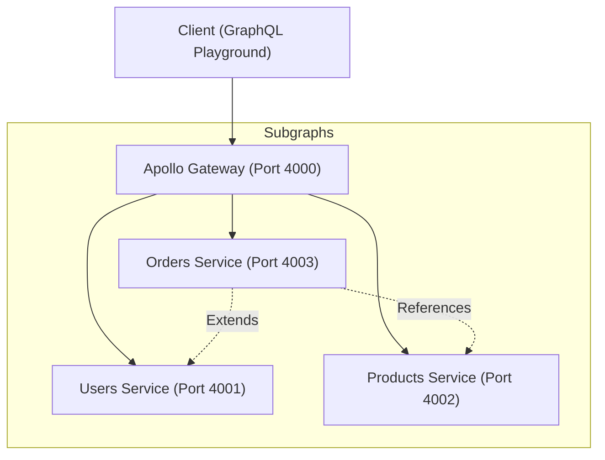

# Shop GraphQL Federation with NestJS

A distributed GraphQL architecture using **Apollo Federation v2** and **NestJS**. This project demonstrates how to split a large GraphQL API into separate, manageable microservices (subgraphs) and compose them into a single endpoint via a Gateway.

## 🏗️ Architecture



### Services Detail

| Service      | Port | Description                                       | Managed Entities                                   |
| :----------- | :--- | :------------------------------------------------ | :------------------------------------------------- |
| **Gateway**  | 4000 | The entry point that composes all subgraphs.      | N/A                                                |
| **Users**    | 4001 | Handles user profiles and authentication data.    | `User`                                             |
| **Products** | 4002 | Manages the product catalog.                      | `Product`                                          |
| **Orders**   | 4003 | Handles transactions and links users to products. | `Order`, `User` (extended), `Product` (referenced) |

---

## 🚀 Getting Started

### Prerequisites

- Node.js (v18 or higher recommended)
- npm

### Installation

Install all root dependencies and service-specific packages:

```bash
# Install root tools (concurrently, wait-on)
npm install

# All sub-services are already initialized with:
# @nestjs/apollo, @apollo/subgraph, @apollo/server, @as-integrations/express5, etc.
```

### Running the Services

You can start all services and the gateway simultaneously using the consolidated command:

```bash
npm run start:all
```

This will:

1. Start **Users**, **Products**, and **Orders** services.
2. Wait for them to be healthy (Port 4001, 4002, 4003).
3. Start the **Gateway** (Port 4000).

---

## 🔍 Example Queries

Access the GraphQL Playground at: [http://localhost:4000/graphql](http://localhost:4000/graphql)

### 1. Fetch Orders with Full Details

This query demonstrates cross-service resolution. The `user` and `products` fields are resolved by stitching data from different services.

```graphql
query GetOrdersWithDetails {
  orders {
    id
    user {
      username
      email
    }
    products {
      name
      price
    }
  }
}
```

### 2. Fetch a User with Their Orders

This demonstrates the `@extends` capability, where the Orders service adds a field to the `User` type owned by the Users service.

```graphql
query GetUserOrders {
  user(id: "1") {
    username
    orders {
      id
      products {
        name
      }
    }
  }
}
```

---

## 🛠️ Tech Stack

- **Framework**: [NestJS](https://nestjs.com/)
- **GraphQL**: [Apollo Federation v2](https://www.apollographql.com/docs/federation/)
- **Persistence**: [Prisma](https://www.prisma.io/) with [SQLite](https://www.sqlite.org/)
- **Language**: TypeScript
- **Server**: Express 5 (via `@as-integrations/express5`)

## 💾 Persistence Layer

Each service maintains its own SQLite database (`dev.db` in each service folder) managed by Prisma.

- **Users**: Stores `User` records.
- **Products**: Stores `Product` records.
- **Orders**: Stores `Order` and `OrderItem` (linking product IDs).

To explore the database for any service:

```bash
cd <service-name>
npx prisma studio
```

## 💡 Troubleshooting

If you encounter a `No driver (HTTP) has been selected` error, ensure `@nestjs/platform-express` is installed in the service directory.

If you encounter an error related to `@as-integrations/express5`, it's because this project uses **Express 5**. Ensure both `@apollo/server` and `@as-integrations/express5` are installed in every service.
